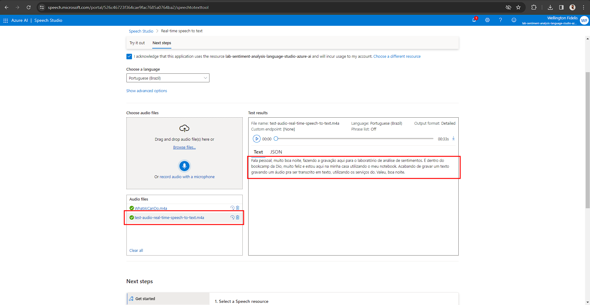
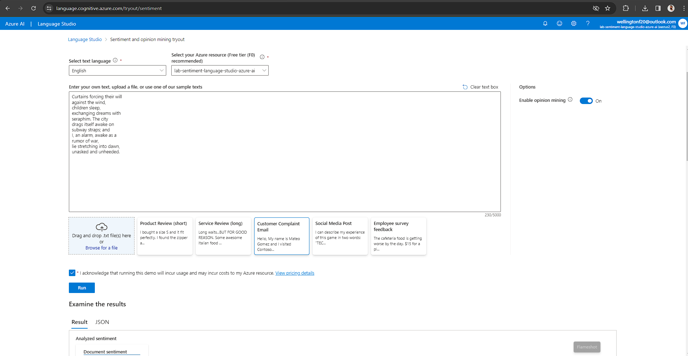
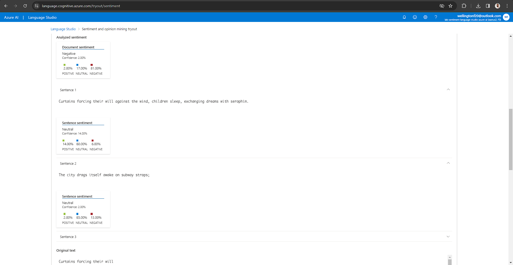

# Sentiment Analysis with Language Studio in Azure AI.

Repository created to pratice resources of Azure AI to sentiment analysis in text on Language Studio an speech to text on Speech Studio.

## Speech Studio

Speech Studio is a set of user interface-based tools for creating and integrating Azure AI Speech service assets into your applications. With Speech Studio, you can create projects using a no-code approach and reference these assets in your applications using the Speech SDK, Speech CLI or REST APIs.

### Steps to use

1. Create a new resource or use the existint
2. Choose the real-time speech to text option
3. Make a audio or upload any audio

### Test

#### Input

#### Output

### Insights

This service can be used to do:

- Captioning: Allows you to sync captions with input audio, apply profanity filters, get partial results, and identify spoken languages for ultilingual scenarios.
- Call Center: Analyzes call center conversations, transcribes real-time calls, or processes a batch of calls, extracting insights such as sentiment.
- Real-time Speech-to-Text Conversion: Quickly test speech-to-text conversion by dragging audio files without writing code.
Batch Speech-to-Text Conversion: Asynchronously transcribe large amounts of audio.
- Custom Speech: Create speech recognition models tailored to specific vocabularies and styles.
Pronunciation Assessment: Evaluate audio pronunciation accuracy and fluency.

## Language Studio

Language Studio is a set of UI-based tools that allows you to explore, create and integrate Azure AI Language features into your applications. It provides a platform for experimenting with various service features and seeing what they return in a visual way. In addition, Language Studio offers an easy-to-use experience for creating customized projects and models for working with your data.

### Steps

1. Create a new resource or use the existint
2. Choose the the classification Classify text
3. select the Analyze sentiment and mine opinions tile
4. Select the language of the text
5. Select the resource created
6. Input the text
7. Click in Run
8. Check the analysis

### Test

#### Input

> Curtains forcing their will
> against the wind,
> children sleep,
> exchanging dreams with
> seraphim. The city
> drags itself awake on
> subway straps; and
> I, an alarm, awake as a
> rumor of war,
> lie stretching into dawn,
> unasked and unheeded.

#### Output

### Insights

This feature is particularly useful for analyzing social media posts, customer feedback, and any text where sentiments may change rapidly from sentence to sentence1.
